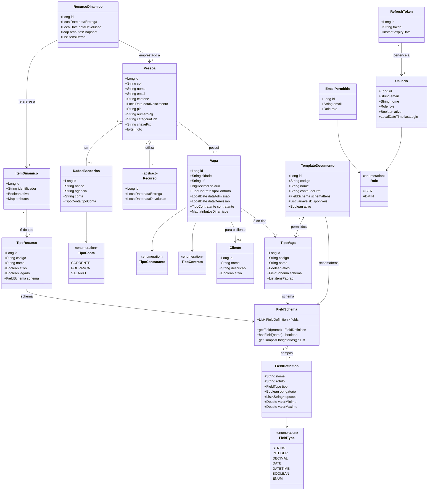

# 📋 Sistema de Cadastro de Pessoas, Vagas e Recursos

Este projeto é uma aplicação Java com Spring Boot que permite o **cadastro de pessoas**, o controle de suas **vagas trabalhadas**, os **recursos utilizados** (como celulares e carros), e a **geração de documentos** com base nessas informações.

---

## 🧩 Funcionalidades

- 📌 Cadastro e atualização de **pessoas** por CPF
- 🅿️ Registro de **vagas** ocupadas por cada pessoa
- 🚗 Controle de **recursos utilizados**:
  - Celulares
  - Carros
- 📄 Geração de **documentos** personalizados
- 📥 Importação de dados a partir de planilhas Excel
- 🔄 Atualização automática de registros existentes durante a importação

---

## 🛠️ Tecnologias Utilizadas

- **Java 17+**
- **Spring Boot**
- **Spring Data JPA**
- **Hibernate**
- **Apache POI** – leitura de planilhas Excel
- **PostgreSQL** – banco de dados relacional
- **Lombok** – para reduzir boilerplate
- **Maven** – gerenciamento de dependências
- **Thymeleaf ou PDF Generator** – para geração de documentos
- **springdoc-openapi** – documentação da API (Swagger UI)
- **Liquibase** – versionamento do schema do banco de dados
- **Docker** – containerização da aplicação
- **JWT + OAuth2 (Google)** – autenticação e autorização

---

## 🗂️ Diagrama de Classes

